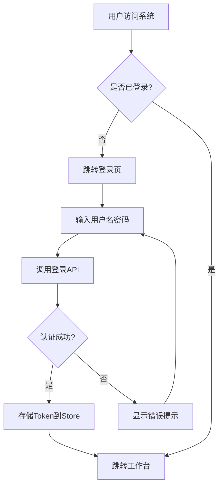
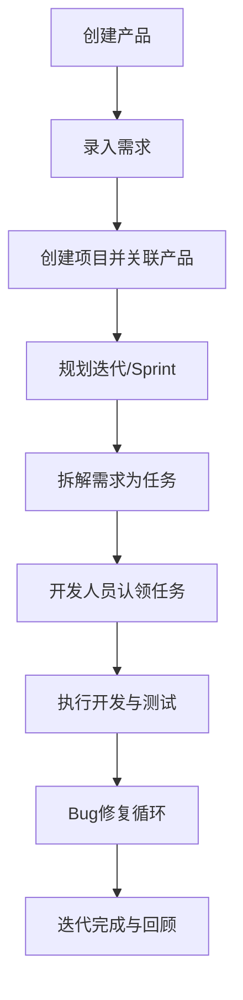

# Leap One 项目管理系统 - 产品需求文档 (PRD)

## 1. 产品概述

Leap One 是一款面向中大型企业的全生命周期项目管理系统，对标禅道（ZenTao）但采用现代化技术栈和交互设计。系统覆盖从需求分析、任务分配、迭代管理、质量保障到工单跟踪的完整研发流程，支持多产品线、项目集、敏捷/瀑布混合模式管理。

- **目标用户**：项目经理、产品经理、开发工程师、测试工程师、运维人员、管理层
- **核心价值**：统一研发协作平台、可视化进度追踪、智能化辅助决策、企业级权限管控

## 2. 核心功能

### 2.1 用户角色

| 角色 | 核心权限 |
|------|----------|
| 超级管理员 | 系统配置、用户管理、组织架构、全部数据访问 |
| 管理员 | 组织内用户/项目管理、角色分配、数据查看与操作 |
| 项目经理 | 项目创建与管理、迭代规划、任务分配、进度监控 |
| 产品经理 | 需求管理、产品路线图、优先级排序、需求评审 |
| 开发工程师 | 任务认领与执行、代码关联、工时填报 |
| 测试工程师 | 用例编写、Bug提交与跟踪、测试计划执行 |
| 普通成员 | 查看分配的任务、更新状态、参与讨论 |

### 2.2 功能模块

1. **认证中心**：登录/登出、Token管理、记住密码
2. **工作台/Dashboard**：个人概览、统计卡片、最近动态、待办快捷入口
3. **用户管理**：用户列表、用户详情/编辑
4. **组织管理**：部门管理、角色与权限管理
5. **项目集管理**：项目集列表、层级关系
6. **产品管理**：产品列表、产品路线图
7. **项目管理**：项目列表、项目详情、迭代管理、看板视图
8. **需求管理**：需求列表、需求详情
9. **任务管理**：任务列表、任务分配
10. **质量管理**：测试用例、Bug跟踪、测试计划
11. **工单管理**：工单列表与处理
12. **文档管理**：文档列表与在线预览
13. **看板视图**：拖拽式看板
14. **BI大屏**：数据统计与可视化
15. **系统设置**：全局配置
16. **个人中心**：个人信息修改

### 2.3 页面详情

| 页面名称 | 模块名称 | 功能描述 |
|-----------|-------------|---------------------|
| 登录页 | 认证中心 | 居中卡片布局、用户名密码表单、记住密码、登录跳转 |
| 工作台 | Dashboard | 统计卡片（我的任务/需求/Bug/工单数量）、最近动态时间线、待办快捷入口 |
| 用户列表 | 用户管理 | 表格展示用户、搜索筛选、新增/编辑/删除/禁用用户 |
| 用户详情 | 用户管理 | 用户基本信息展示与编辑、角色分配 |
| 部门管理 | 组织管理 | 树形部门结构、新增/编辑/删除部门 |
| 角色管理 | 组织管理 | 角色列表、权限矩阵配置 |
| 项目集列表 | 项目集管理 | 项目集卡片/表格展示、CRUD操作 |
| 产品列表 | 产品管理 | 产品信息表格、搜索筛选、状态切换 |
| 产品路线图 | 产品管理 | 时间轴形式展示版本规划与里程碑 |
| 项目列表 | 项目管理 | 项目卡片/表格、多维度筛选、快捷操作 |
| 项目详情 | 项目管理 | 项目基本信息、成员列表、关联产品、统计数据 |
| 迭代列表 | 项目管理 | 迭代Sprint列表、燃尽图、任务分布 |
| 看板板 | 项目管理 | 拖拽式Kanban列（待处理/进行中/已完成等） |
| 需求列表 | 需求管理 | 需求表格、优先级/状态筛选、批量操作 |
| 需求详情 | 需求管理 | 需求完整信息、关联任务/Bug、评论历史 |
| 任务列表 | 任务管理 | 任务表格、指派人筛选、状态流转 |
| 测试用例 | 质量管理 | 用例库管理、用例分类、执行记录 |
| Bug列表 | 质量管理 | Bug追踪表、严重程度标记、修复流程 |
| 测试计划 | 质量管理 | 测试计划列表、执行进度、报告生成 |
| 工单列表 | 工单管理 | 工单追踪、类型分类、处理状态 |
| 文档列表 | 文档管理 | 文档树形目录、在线查看、版本管理 |
| 看板视图 | 看板 | 全局跨项目看板、拖拽排序 |
| BI大屏 | BI | 多维度图表统计、关键指标卡片 |
| 系统设置 | 设置 | 基础配置、通知模板、日志查看 |
| 个人中心 | 个人 | 头像昵称修改、密码变更、偏好设置 |

## 3. 核心流程

### 3.1 用户登录与认证流程

### 3.2 项目管理主流程

## 4. 用户界面设计

### 4.1 设计风格

- **主色调**：深蓝色 `#1677ff`（Ant Design 主色），辅以青色 `#13c2c2` 作为功能强调色
- **配色方案**：支持亮色/暗色双主题切换
- **按钮风格**：圆角按钮（border-radius: 6px）、微渐变效果
- **字体**：中文使用系统默认字体栈（PingFang SC / Microsoft YaHei），英文/数字使用 Inter
- **布局风格**：左侧可折叠导航 + 顶部固定Header + 右侧内容区（ProLayout风格）
- **图标风格**：@ant-design/icons 线性图标体系
- **动效**：页面切换过渡动画、卡片悬浮阴影变化、侧边栏折叠动画

### 4.2 页面设计概览

| 页面名称 | UI元素说明 |
|-----------|------------|
| 登录页 | 居中白色卡片、品牌Logo+名称、表单输入框带图标前缀、记住密码复选框、渐变背景 |
| 工作台 | 顶部欢迎语+日期、4个统计卡片（不同颜色标识）、时间线组件、快捷入口网格 |
| 列表页 | 顶部搜索栏+操作按钮区、Ant Design Table表格、分页器、批量操作工具栏 |
| 详情页 | 顶部返回+标题操作栏、Tab切换内容区（基本信息/关联项/操作日志） |
| 看板页 | 多列卡片布局、拖拽手柄、列头显示数量统计、卡片悬浮详情浮层 |

### 4.3 响应式策略

- **桌面端优先**（≥1280px）：完整三栏布局（导航+内容+可选面板）
- **平板适配**（768px~1279px）：侧边栏可收缩为图标模式
- **移动端优化**（<768px）：底部标签导航替代侧边栏

## 5. 技术约束

- 所有TSX文件必须使用TypeScript strict模式
- 禁止使用 `any` 类型（特殊情况需注释说明）
- API调用通过TanStack Query统一管理
- 组件基于Ant Design 5构建
- 中文注释
