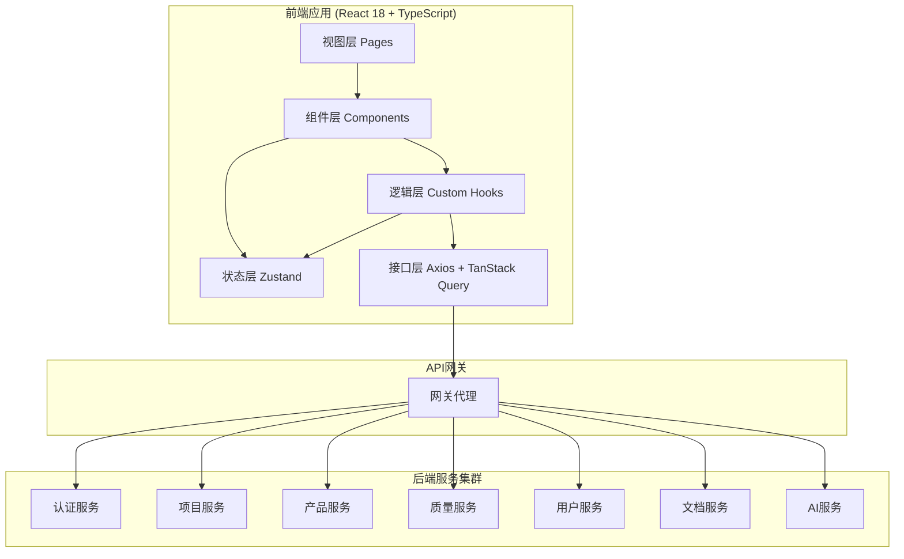
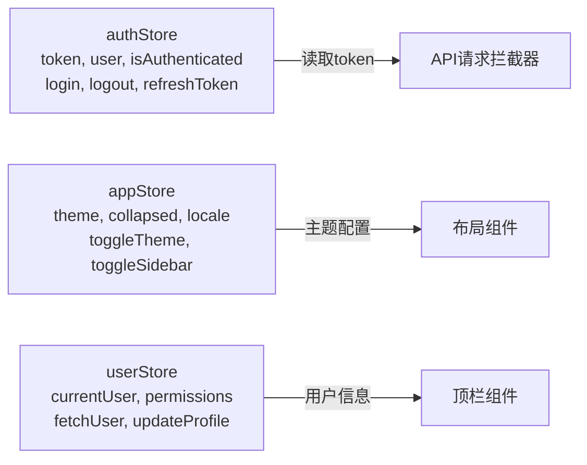

# Leap One 项目管理系统 - 技术架构文档

## 1. 架构设计



## 2. 技术选型

| 技术 | 版本 | 用途 |
|------|------|------|
| React | ^18.3.1 | UI框架 |
| TypeScript | ^5.6.2 | 类型安全（strict模式） |
| Ant Design | ^5.21.0 | UI组件库 |
| @ant-design/pro-components | ^2.7.0 | 高级业务组件 |
| React Router DOM | ^6.26.0 | 客户端路由 |
| Axios | ^1.7.7 | HTTP客户端 |
| TanStack React Query | ^5.56.0 | 服务端状态管理 |
| Zustand | ^4.5.5 | 客户端状态管理 |
| Day.js | ^1.11.13 | 日期处理 |
| React Hook Form | ^7.53.0 | 表单管理 |
| ahooks | ^3.8.0 | React常用Hooks集合 |
| Vite | ^5.4.7 | 构建工具 |
| Less | ^4.2.1 | CSS预处理器 |

## 3. 目录结构与职责

```
leap-one-web/
├── src/
│   ├── api/              # API接口封装层 - 按业务域划分
│   ├── assets/           # 静态资源（样式、图片）
│   ├── components/       # 可复用组件（Layout/Common/Business）
│   ├── hooks/            # 自定义Hooks（认证、权限、主题、分页）
│   ├── pages/            # 页面组件（按功能模块）
│   ├── routes/           # 路由配置与守卫
│   ├── store/            # Zustand全局状态
│   ├── types/            # TypeScript类型定义
│   ├── utils/            # 工具函数
│   ├── App.tsx           # 应用根组件
│   └── main.tsx          # 入口文件
├── public/               # 公共静态资源
├── package.json
├── tsconfig.json         # TS严格模式配置
└── vite.config.ts        # Vite构建配置（含代理）
```

## 4. 路由定义

| 路由路径 | 页面组件 | 是否需要认证 | 说明 |
|----------|---------|:---:|------|
| `/login` | Login | 否 | 登录页 |
| `/` | Dashboard | 是 | 工作台首页 |
| `/user/list` | UserList | 是 | 用户列表 |
| `/user/:id` | UserProfile | 是 | 用户详情 |
| `/org/department` | Department | 是 | 部门管理 |
| `/org/role` | RoleManage | 是 | 角色管理 |
| `/program` | ProgramList | 是 | 项目集列表 |
| `/product/list` | ProductList | 是 | 产品列表 |
| `/product/:id/roadmap` | ProductRoadmap | 是 | 产品路线图 |
| `/project/list` | ProjectList | 是 | 项目列表 |
| `/project/:id` | ProjectDetail | 是 | 项目详情 |
| `/project/:id/iteration` | IterationList | 是 | 迭代列表 |
| `/project/:id/kanban` | KanbanBoard | 是 | 项目看板 |
| `/requirement/list` | RequirementList | 是 | 需求列表 |
| `/requirement/:id` | RequirementDetail | 是 | 需求详情 |
| `/task/list` | TaskList | 是 | 任务列表 |
| `/quality/testcase` | TestCaseList | 是 | 测试用例 |
| `/quality/bug` | BugList | 是 | Bug列表 |
| `/quality/testplan` | TestPlanList | 是 | 测试计划 |
| `/issue/list` | IssueList | 是 | 工单列表 |
| `/document/list` | DocumentList | 是 | 文档列表 |
| `/kanban` | KanbanView | 是 | 全局看板 |
| `/bi/dashboard` | Dashboard(BI) | 是 | BI大屏 |
| `/settings` | SystemSettings | 是 | 系统设置 |
| `/profile` | Profile | 是 | 个人中心 |

## 5. API 定义

### 5.1 通用响应格式

```typescript
// 成功响应
interface ApiResponse<T> {
  code: number;      // 0 表示成功
  message: string;   // 提示信息
  data: T;           // 业务数据
}

// 分页响应
interface PaginatedResponse<T> {
  code: number;
  message: string;
  data: {
    list: T[];
    total: number;
    page: number;
    pageSize: number;
  };
}
```

### 5.2 认证相关API

| 方法 | 路径 | 说明 | 请求体 | 响应 |
|------|------|------|--------|------|
| POST | `/api/auth/login` | 登录 | `{ username, password, remember }` | `ApiResponse<{ token, user }>` |
| POST | `/api/auth/logout` | 登出 | - | `ApiResponse<null>` |
| POST | `/api/auth/refresh` | 刷新Token | - | `ApiResponse<{ token }>` |
| GET | `/api/auth/captcha` | 获取验证码 | - | `ApiResponse<{ captchaId, image }>` |

### 5.3 用户服务API

| 方法 | 路径 | 说明 |
|------|------|------|
| GET | `/api/user/list` | 用户列表（分页） |
| GET | `/api/user/:id` | 用户详情 |
| POST | `/api/user` | 创建用户 |
| PUT | `/api/user/:id` | 更新用户 |
| DELETE | `/api/user/:id` | 删除用户 |
| PUT | `/api/user/:id/status` | 启用/禁用用户 |
| PUT | `/api/user/password` | 修改密码 |

### 5.4 项目服务API

| 方法 | 路径 | 说明 |
|------|------|------|
| GET | `/api/project/list` | 项目列表 |
| GET | `/api/project/:id` | 项目详情 |
| POST | `/api/project` | 创建项目 |
| PUT | `/api/project/:id` | 更新项目 |
| DELETE | `/api/project/:id` | 删除项目 |
| GET | `/api/project/:id/iteration` | 迭代列表 |
| GET | `/api/project/:id/members` | 项目成员 |
| PUT | `/api/project/:id/members` | 更新成员 |

### 5.5 其他服务API（类似模式）

- 产品服务：`/api/product/*`
- 需求服务：`/api/requirement/*`
- 任务服务：`/api/task/*`
- 质量服务：`/api/quality/*`
- 工单服务：`/api/issue/*`
- 文档服务：`/api/document/*`
- 看板服务：`/api/kanban/*`
- BI统计服务：`/api/bi/*`
- 通知服务：`/api/notification/*`
- 搜索服务：`/api/search/*`
- AI服务：`/api/ai/*`

## 6. 状态管理设计

### 6.1 Zustand Store 结构



### 6.2 数据流原则

- **服务端状态**（API数据）：通过 TanStack Query 管理，自动缓存、刷新、重试
- **客户端状态**（UI状态）：通过 Zustand 管理（主题、侧边栏、认证信息）
- **表单状态**：通过 React Hook Form 管理

## 7. 构建与部署

### 7.1 开发环境

- Vite Dev Server + 代理转发到后端网关
- 热模块替换(HMR)
- ESLint + Prettier 实时代码检查

### 7.2 生产构建

- TypeScript 类型检查 → Vite 构建 → 输出到 `dist/`
- Dockerfile 多阶段构建（Node构建 → Nginx托管）
- Nginx 配置 SPA 路由回退 + API反向代理 + Gzip压缩

### 7.3 环境变量

| 变量名 | 说明 | 示例 |
|--------|------|------|
| VITE_API_BASE_URL | API基础路径 | `http://localhost:8080/api` |
| VITE_APP_TITLE | 应用标题 | `Leap One 项目管理系统` |
